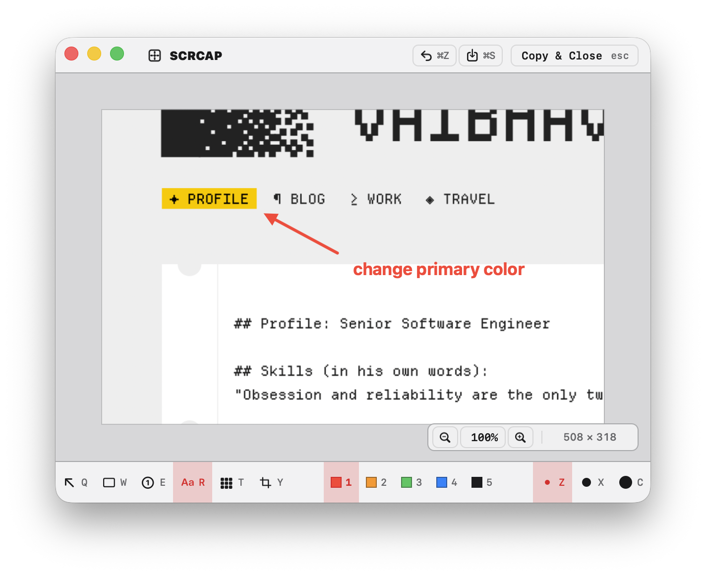
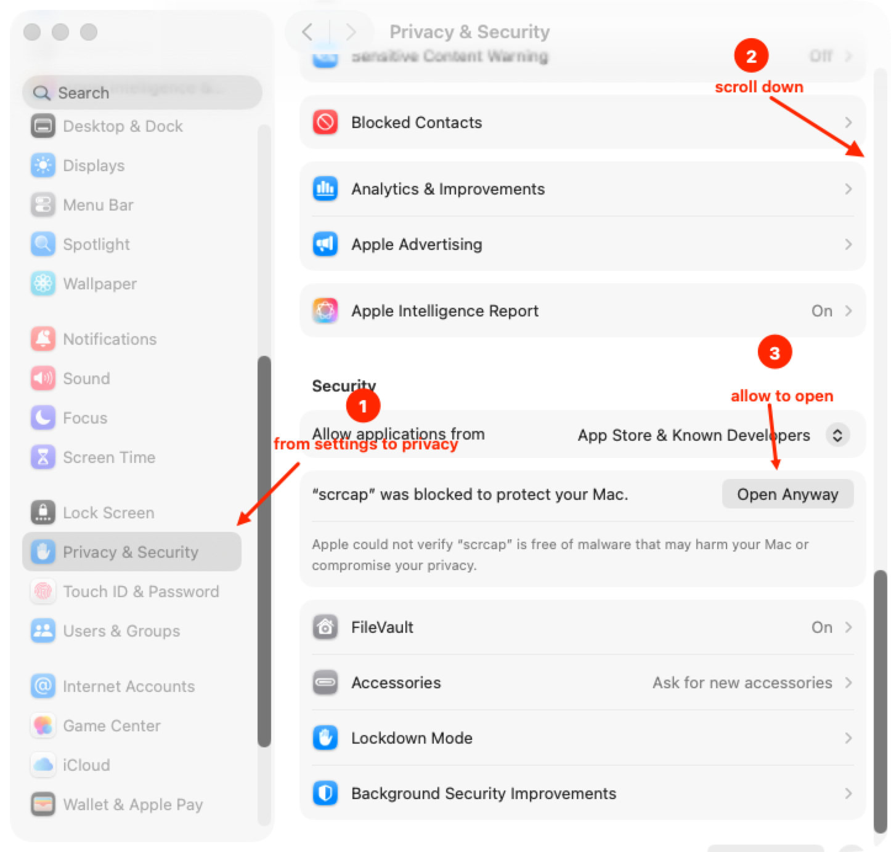

# scrcap

Capture at the speed of thought. scrcap is a tiny, keyboard-first macOS
screenshot app for region, window, fullscreen, scrolling, delayed, and repeat
captures with fast annotation and PNG export.

Take a screenshot, mark it up, and drop it on your clipboard superfast. macOS
native (Swift + AppKit, zero dependencies); portable core by design.



## Features

- Global hotkeys for region, window, fullscreen, scrolling, delayed region, and
  repeat-last capture.
- Region picker with crosshair, live coordinates, and Space-to-move selection.
- Window picker with hover highlight and Tab cycling for overlapping windows.
- Fast editor with arrows, rectangles, numbered counters, text, pixelate, crop,
  undo/redo, zoom, drag-out, and auto-expanding canvas.
- Configurable capture behavior: open editor, copy only, or copy and open
  editor per capture mode.
- Preferences for shortcuts, palette colors, stroke width, text size, Return
  behavior, pointer capture, window shadows/backgrounds, output folder,
  filename pattern, PNG scale, theme, launch at login, and notifications.

## Install

Requires macOS 14+.

1. Download `scrcap-macos.dmg` from the latest GitHub Release.
2. Open the DMG.
3. Drag `scrcap.app` to `Applications`.
4. Open `scrcap` from Applications.

Older or explicitly unnotarized builds may show **"scrcap" Not Opened** the
first time. If that happens:

1. Click **Done**.
2. Open **System Settings**.
3. Go to **Privacy & Security**.
4. Scroll down to the **Security** section.
5. Click **Open Anyway** next to the message that says `"scrcap" was blocked`.
6. Confirm **Open** when macOS asks again.



After the first successful open, scrcap launches normally. On first capture,
macOS asks for **Screen Recording** permission. Scrolling capture asks for
**Accessibility** permission the first time you use it.

## Build & run

Requires macOS 14+ and a Swift 6 toolchain (Command Line Tools are enough).

```sh
swift run scrcap              # run directly (dev)
swift run scrcap-core-tests   # run the portable-core test suite
scripts/test.sh               # build + core tests + AppKit smoke tests
scripts/make_app.sh           # app bundle → dist/scrcap.app (+ size budget gate)
```

First capture prompts for **Screen Recording** permission; scrcap detects the
grant live. Scrolling capture additionally asks for **Accessibility** the first
time you use it — never up front.

> When running via `swift run`, macOS attributes permissions to your terminal.
> Use `dist/scrcap.app` for the real permission flow.

**One-time:** run `scripts/make_dev_cert.sh` to create a stable self-signed
signing identity. `scripts/make_app.sh` requires stable signing by default
because ad-hoc signing makes macOS treat every rebuild as a new app, forcing
you to re-grant Screen Recording. For a throwaway build only, run
`SCRCAP_ALLOW_ADHOC=1 scripts/make_app.sh`.

For a trusted manual release, store App Store Connect credentials once and
build with a Developer ID identity:

```sh
xcrun notarytool store-credentials scrcap-notary
CODESIGN_IDENTITY="Developer ID Application: Your Name (TEAMID)" \
SCRCAP_NOTARY_PROFILE=scrcap-notary \
SCRCAP_VERSION=1.0.0 scripts/make_app.sh --prod
```

For an intentional unnotarized release, add
`SCRCAP_ALLOW_UNNOTARIZED=1`. Development builds continue to use the local
`scrcap-dev` identity.

`--prod` creates a fresh `dist/` containing only:

- `scrcap.app` — signed macOS app bundle
- `scrcap-macos.zip` — compressed app bundle for GitHub Releases
- `scrcap-macos.dmg` — simple drag-to-Applications disk image

The app bundle is stripped, optimized for size, and checked so development
artifacts such as `.DS_Store`, Swift module files, object files, and dSYM
bundles cannot slip into the release output.

To publish a GitHub Release manually, create a version tag and upload
`dist/scrcap-macos.zip` and `dist/scrcap-macos.dmg`:

```sh
git tag v1.0.0
CODESIGN_IDENTITY="Developer ID Application: Your Name (TEAMID)" \
SCRCAP_NOTARY_PROFILE=scrcap-notary \
scripts/make_app.sh --prod
```

## Default hotkeys (all remappable in Preferences → Shortcuts)

| Mode | Hotkey | Notes |
|---|---|---|
| Region | ⌥⇧1 | crosshair + live coords, Space moves selection mid-drag, Esc aborts |
| Window | ⌥⇧2 | hover highlight, ⇥ cycles overlapping windows |
| Fullscreen | ⌥⇧3 | display under cursor, zero UI |
| Scrolling | ⌥⇧4 | select a region, scrcap scrolls & stitches |
| Delayed region | ⌥⇧5 | countdown before region capture |
| Repeat last | ⌥⇧R | re-captures the previous capture target |

## Editor

Every capture opens the editor (per-mode override in Preferences). Draw stays
armed — no selection state; got it wrong → ⌘Z and draw again.

| Key | Action |
|---|---|
| Q / W / E / R / T / Y | arrow / rectangle / counter / text / pixelate / crop tool |
| 1–5 | color (slot 1 is the default on every new shot) |
| Z / X / C | small / medium / large annotation size |
| ⇧-drag | constrain rectangle to square |
| text tool | click to type · Return behavior is configurable · Esc exits typing |
| Esc | **copy to clipboard + close** by default (configurable) |
| ⌘Z / ⇧⌘Z | undo / redo |
| ⌘C | copy, keep editor open |
| ⌘S | save PNG to the configured folder |
| ⇧⌘S | save as PNG… |
| ⌘+ / ⌘- / ⌘0 | zoom in / zoom out / reset zoom |
| ⌘W | discard & close |
| ⌥-drag | drag flattened PNG out (Slack, Finder, mail…) |

Drag the toolbar's empty background to move the editor window.

## Layout

- `Sources/ScrcapCore/` — portable core: annotation model, keymap engine,
  settings schema, stitch aligner. No AppKit. Spec: `docs/core-model.md`.
- `Sources/scrcap/` — macOS app: ScreenCaptureKit capture, Carbon hotkeys,
  overlay, editor, exporter, SwiftUI preferences.
- `Sources/scrcap-core-tests/` — core test suite (plain executable; the
  CLT-only toolchain ships no XCTest).
- `scripts/` — `make_app.sh` (bundle + stable sign + release zip/DMG),
  `check_budgets.sh` (size and artifact gate, < 5 MB).

Settings live at `~/Library/Application Support/scrcap/settings.json` —
versioned, human-readable, dotfiles-friendly.

## Windows port

The Windows port lives in `scrcap-windows/`. It is a C#/.NET 8 solution with a
portable `Scrcap.Core` project and Windows-only WPF/platform projects. Build,
test, guardrail, and remaining Windows verification gates are documented in
`scrcap-windows/README.md`.
